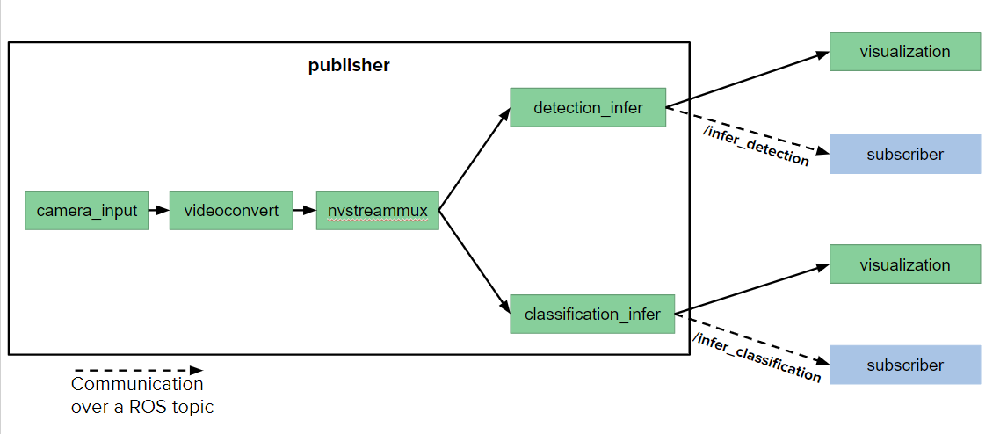
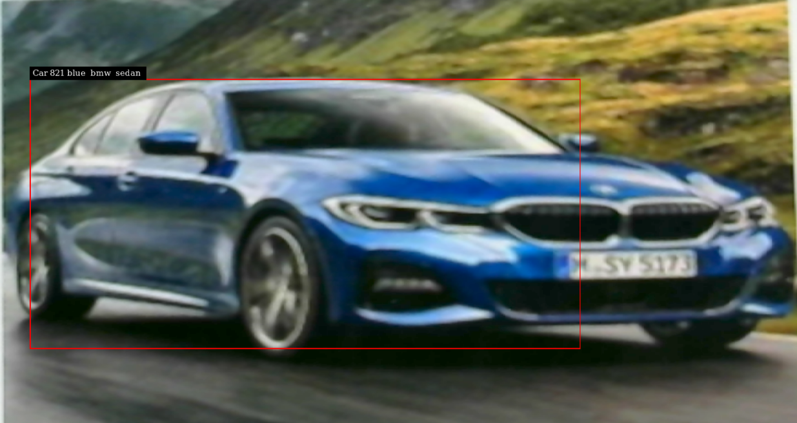
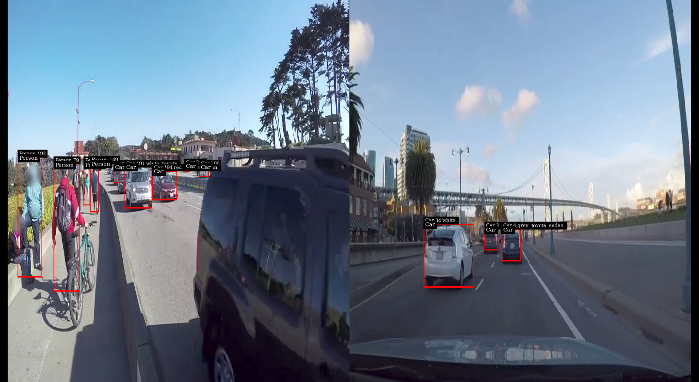

# DeepStream_ROS2

ROS2 nodes for DeepStream applications.

This work is based on sample applications from the [DeepStream Python Apps](https://github.com/NVIDIA-AI-IOT/deepstream_python_apps) project. The packages have been tested on NVIDIA Jetson AGX Xavier with Ubuntu 18.04, ROS Eloquent, DeepStream SDK 5.0 (or later) and TensorRT. The project accesses some files in the DeepStream 5.0 root location (/opt/nvidia/deepstream/deepstream/samples/).

This project includes ROS2 publisher nodes which take a single/multiple video streams as input from webcam or from file:

1. **single_stream** node: This performs 2 inference tasks on a single video input:

- **Object Detection:** Detects 4 classes of objects: Vehicle, Person, Road Sign, Two wheeler.
- Output of this inference is published on topic '**infer_detection**'.

- **Attribute Classification:** For objects of class 'Vehicle', 3 categories of atrributes are identified: color, make and type.
- Output of this inference is published on topic '**infer_classification**'.

2. **multi_stream** node: This takes multiple video files as input, performs the same inference tasks and publishes to topics **multi_detection** and **multi_classification**. 

Sample ROS2 subscriber nodes have also been provided in **subscriber_pkg**, subscribing to the following topics:

| Node | Topic |
| ------ | ------ |
| sub_detection | infer_detection |
| sub_classification | infer_classification |
| sub_multi_detection | multi_detection |
| sub_multi_classification | multi_classification |

## Prerequisites

Ubuntu 18.04

Python 3.6

[DeepStream SDK 5.0](https://developer.nvidia.com/deepstream-getting-started) or later

NumPy

OpenCV

[vision_msgs](https://github.com/Kukanani/vision_msgs/tree/ros2)

[Gst Python](https://gstreamer.freedesktop.org/modules/gst-python.html) v1.14.5 (should already be installed on Jetson)

If missing, install using following commands:

`sudo apt update`

`sudo apt install python3-gi python3-dev python3-gst-1.0 -y`

## Running the ROS2 nodes

1. Clone this repo into the **src** folder inside your ROS2 workspace ([creating a ROS2 workspace](https://index.ros.org/doc/ros2/Tutorials/Workspace/Creating-A-Workspace/)) using the following command:

`git clone https://github.com/NVIDIA-AI-IOT/ros2_deepstream.git`

The directory structure should look like this:

```python
.
+- dev_ws
   +- src
      +- ros2_deepstream
         +- common
         +- config_files
            +- dstest1_pgie_config.txt (several other config files)
         +- single_stream_pkg
         +- multi_stream_pkg
         +- subscriber_pkg
            +- resource
            +- subscriber_pkg
            +- test
            +- package.xml
            +- setup.cfg
            +- setup.py     
```

2. To build the package, navigate back to your workspace and run the following:

`colcon build`

3. Source your main ROS 2 installation:

`source /opt/ros/eloquent/setup.bash`

4. Then, to source your workspace, run the following command from your workspace:

`. install/setup.bash`

5. To run the **single_stream** publisher node, run the following command by specifying the **input_source**. This command will take some time to start and print log messages to the console.

`ros2 run single_stream_pkg single_stream --ros-args -p input_source:="/dev/video0"`

This project has been tested using a Logitech C270 usb webcam to capture camera stream as input. H.264/H.265 video streams can also be given as input as shown later in this repo.

6. To run the subscribers, open separate terminals, navigate to your ros workspace and repeat step 4 in each. 

**sub_detection** subscribes to output from detection inference.

`ros2 run subscriber_pkg sub_detection`

**sub_classification** subscribes to output from classification inference.

`ros2 run subscriber_pkg sub_classification`

To understand the application workflow better:



The pipeline uses a GStreamer **tee** element to branch out and perform different tasks after taking video input. In this example, we perform only two tasks but more tasks can be added to the pipeline easily.

An example output:



Message received by the node subscribing to topic **infer_detection**: 

```
[vision_msgs.msg.Detection2D(header=std_msgs.msg.Header(stamp=builtin_interfaces.msg.Time(sec=0, nanosec=0), frame_id=''), results=[vision_msgs.msg.ObjectHypothesisWithPose(id='Car', score=0.4975374639034271, pose=geometry_msgs.msg.PoseWithCovariance(pose=geometry_msgs.msg.Pose(position=geometry_msgs.msg.Point(x=0.0, y=0.0, z=0.0), orientation=geometry_msgs.msg.Quaternion(x=0.0, y=0.0, z=0.0, w=1.0)), covariance=array([0., 0., 0., 0., 0., 0., 0., 0., 0., 0., 0., 0., 0., 0., 0., 0., 0.,
       0., 0., 0., 0., 0., 0., 0., 0., 0., 0., 0., 0., 0., 0., 0., 0., 0.,
       0., 0.])))], bbox=vision_msgs.msg.BoundingBox2D(center=geometry_msgs.msg.Pose2D(x=733.5, y=70.3125, theta=0.0), size_x=627.0, size_y=303.75), source_img=sensor_msgs.msg.Image(header=std_msgs.msg.Header(stamp=builtin_interfaces.msg.Time(sec=0, nanosec=0), frame_id=''), height=0, width=0, encoding='', is_bigendian=0, step=0, data=[]), is_tracking=False, tracking_id='')]
```

The **infer_detection** topic publishes messages in the `vision_msgs` Detection2DArray type.

Message received by the node subscribing to topic **infer_classification**: 

`[vision_msgs.msg.ObjectHypothesis(id='blue', score=0.9575958847999573), vision_msgs.msg.ObjectHypothesis(id='bmw', score=0.6080179214477539), vision_msgs.msg.ObjectHypothesis(id='sedan', score=0.8021238446235657)]`

The **infer_classification** topic publishes messages in the `vision_msgs` Classification2D type. These messages contain information about the color, make and type of detected cars alongwith their confidence scores.

## Multi input publisher node

For applications that take videos from multiple input sources, we have provided node **multi_stream**. This takes multiple H.264/H.265 video streams as input and performs inference (detection and classification). Output is published on topics **multi_detection** and **multi_classification** in Detection2DArray and Classification2D types respectively. 

Run the multi_stream publisher using the following command (check that workspace is sourced by following steps 3 and 4 above). This command will take some time to start and print log messages to the console.

`ros2 run multi_stream_pkg multi_stream --ros-args -p input_sources:="['file://<absolute path to file1.mp4>', 'file://<absolute path to file2.mp4>']"`

For instance, you can use some sample videos that come with the DeepStream installation:

`ros2 run multi_stream_pkg multi_stream --ros-args -p input_sources:="['file:///opt/nvidia/deepstream/deepstream/samples/streams/sample_1080p_h264.mp4', 'file:///opt/nvidia/deepstream/deepstream/samples/streams/sample_qHD.mp4']"`

The command above takes input from two sources. This can be modified to take input from one or more sources by specifying the input file names in the list **input_sources**.

To run the sample subscribers, open separate terminals, navigate to your ros workspace and repeat step 4 above in each.

**sub_multi_detection** subscribes to topic multi_detection.

`ros2 run subscriber_pkg sub_multi_detection`

**sub_multi_classification** subscribes to topic multi_classification.

`ros2 run subscriber_pkg sub_multi_classification`

An example output:



## Performance
```
Fps of stream 1 is 36.6
Fps of stream 0 is 36.6

Fps of stream 1 is 40.4
Fps of stream 0 is 40.0
```

FPS with one input video source for **multi_stream** node was observed to be between 30-40; with two input sources was observed to be between 20-30; and with three sources was observed to be between 20-25 (with JAX in **MODE 15W**).

To see the rate at which data is being published on topic **multi_detection**, open a separate terminal and source it (Step 3 above). Make sure the publisher node is running in another terminal and run the following command:

`ros2 topic hz multi_detection`

Replace **multi_detection** with **multi_classification** to see the publishing rate on topic multi_classification.

Sample average rate for multi_detection: 75.96

Sample average rate for inference: 46.599-118.048

## Contact Us
Please let us know if you run into any issues [here](https://github.com/NVIDIA-AI-IOT/ros2_deepstream/issues).

